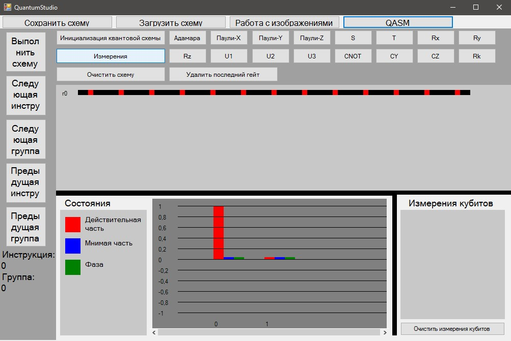

# Quantum Studio
**Студия для создания и симуляции квантовых схем, низкоуровневого программирования на QASM, квантовой обработки изображений.**



## **Создание квантовой схемы**


## **Симуляция квантовой схемы**

## **QASM**
Этот язык вдохновлен идеями OpenQASM, но фокусируется на **низкоуровневом управлении квантовыми схемами** с расширенными возможностями.

Пример кода, выполняющий задачу Дойча-Йожи:

```
#define SIZE_QR_0 1 ;Определяем константу SIZE_QR_0 
#define SIZE_QR_1 1 ;Определяет константу SIZE_QR_1

$defname qr0 : qreg ;Определяем имя qr0 типа qreg
$defname qr1 : qreg ;Определяем имя qr1 типа qreg

$defname r0 : reg ;Определяем имя r0 типа reg

$defname state_qr0 : qstate ;Определяем имя state_qr0 типа qstate
$defname state_qr1 : qstate ;Определяем имя state_qr1 типа qstate

$defname gate0 : gate ;Определяем имя gate0 типа gate

cqr qr0 ;Создаем квантовый регистр 

cqr qr1 ;Создаем квантовый регистр 

cr r0 ;Создаем обычный регистр

cg gate0 ;Создаем квантовый гейт

ssqr qr0, SIZE_QR_0 ;Устанавливаем размер квантовому регистру qr0
ssqr qr1, SIZE_QR_1 ;Устанавливаем размер квантовому регистру qr1

ssr r0, 2 ;Задаем размер обычному регистру r0

gsqr state_qr0, qr0 ;Получаем квантовое состояние квантового регистра qr0
gsqr state_qr1, qr1 ;Получаем квантовое состояние квантового регистра qr1

scs gate0, 2 ;Устанавливаем количество входных состояния гейта gate0 равным 2
scr gate0, 5 ;Устанавливаем количество входных правил гейта gate0 равным 5

sgr gate0, 0, rlh ;Устанавливаем правило под номером 0 rlh
 
sgr gate0, 1, rlx ;Устанавливаем правило под номером 1 rlx
sgr gate0, 2, rlh ;Устанавливаем правило под номером 2 rlh

sgr gate0, 3, rlcx ;Устанавливаем правило под номером 3 rlcx

sgr gate0, 4, rlh ;Устанавливаем правило под номером 4 rlh

sgrs gate0, 0, 0, 0 ;Устанавливаем указатель состояния под номером 0 в правиле гейта под номером 0(rlh), на состояние в гейте под номером 0

sgrs gate0, 1, 0, 1 ;Устанавливаем указатель состояния под номером 0 в правиле гейта под номером 1(rlh), на состояние в гейте под номером 1

sgrs gate0, 2, 0, 1 ;Устанавливаем указатель состояния под номером 0 в правиле гейта под номером 2(rlh), на состояние в гейте под номером 1

sgrs gate0, 3, 0, 0 ;Устанавливаем указатель состояния под номером 0 в правиле гейта под номером 3(rlh), на состояние в гейте под номером 0
sgrs gate0, 3, 1, 1 ;Устанавливаем указатель состояния под номером 1 в правиле гейта под номером 3(rlh), на состояние в гейте под номером 1

sgrs gate0, 4, 0, 0 ;Устанавливаем указатель состояния под номером 0 в правиле гейта под номером 4(rlh), на состояние в гейте под номером 0

sgs gate0, 0, state_qr0 ; Устанавливаем состояние гейта gate0, под номером 0, на state_qr0
sgs gate0, 1, state_qr1 ; Устанавливаем состояние гейта gate0, под номером 1, на state_qr1

ag gate0 ;Применяем гейт

mqsr r0, state_qr0 ;Измеряем состояние state_qr0, в r0

print state_qr0 ;Выводим на экран состояние state_qr0
print r0 ;Выводим на экран результаты измерения state_qr0

```
### **Юридическая информация**

**Название "QASM" используется для обозначения нашего языка квантовых симуляций и не связано с OpenQASM (IBM)**

## **Квантовая обработка изображений**

## **Документация**
Пользовательскую документацию можно получить по [этой ссылке](./docs/ru/index.md).

## **Лицензия**
Проект распространяется под лицензией **MIT**.

Автор: Баранов Илья Дмитриевич

Электронная почта: nmaka228@gmail.com

Telegram: @i6555ranger2